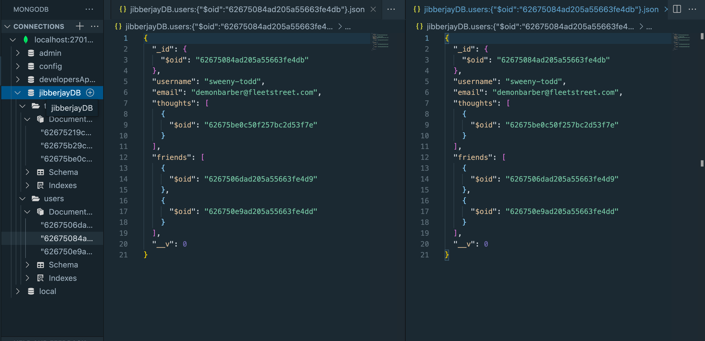
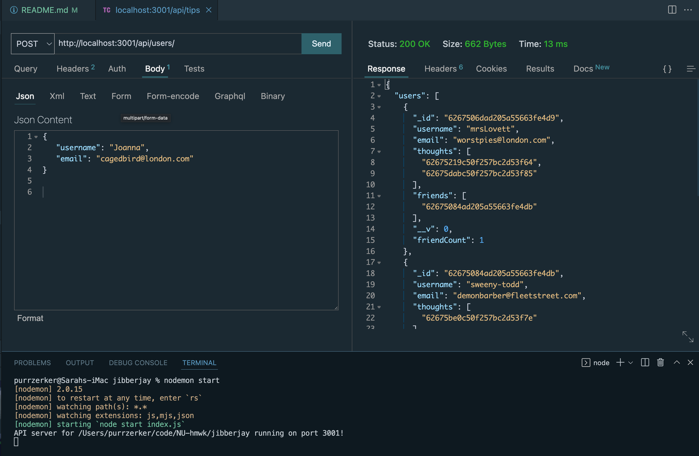

# 18: "JibberJay" - Social Network API

#### Licensed under [MIT](LICENSE)

## Table of Contents

- [Project Description](#project-description)
- [Usage](#usage-instructions)
- [Links](#links)

## Project Description

This node.js program uses the NPM packages Express and Mongoose (and Nodemon) to connect VSCode to MongoBD in order to run a basic social network back-end.

Uses VSCode extensions 'Thunder Client' to test API GET, POST, PUT, DELETE routes to JibberJay database, and MongoDB as a Mongo GUI

## Usage Instructions

To begin, open your terminal and enter <code>nodemon start</code>. Alternatively if you are not using Nodemon, you can use <code>npm run start</code>

Install and open 'Thunder Client' VSCode extension (or your software of choice) to test API routes and database contents

Functionality includes:

- Get users, single user, thoughts, single thought
- Create, update, and delete user(s)
- Add existing users as friends to other users
- Create, update, and delete thought(s)
- Create and delete reactions to thoughts

## Links

- Repository: https://github.com/Sarahlophus/jibberjay
- Walkthrough video: https://drive.google.com/file/d/1J8c3xcs1evbllHnTyoeZp7WvW6vJqR4W/view?usp=sharing
